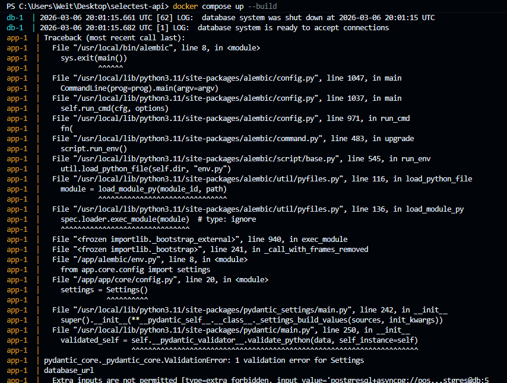
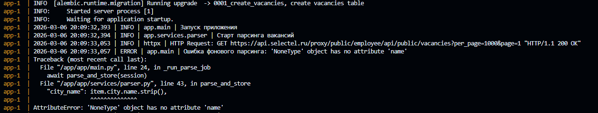
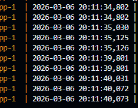

# Результат

## Ответы на вопросы

#### 1. Использовал ли ты ИИ?
Да, использовал. Это инструмент, который было бы неправильно игнорировать в наше время, но и бездумно я его не использовал. О том, как именно, расскажу по каждой ошибке.

#### 2. Как именно он помогал в решении?
В основном я задавал вопросы про конкретную логику реализации кода. То есть я не сталкивался в FastAPI с `@app.on_event` и с библиотекой `scheduler`, поэтому узнавал, как это работает, чтобы было общее представление. Ну и так же под конец попросил перепроверить все мои найденные ошибки и найти самому, и он нашёл то, чего я бы, наверное, не заметил. Ну и конечно, написание этого отчета — это рутинная задача, с которой он очень неплохо справляется, я его всегда об этом прошу. Понятно, что я проверяю и что-то исправляю, этот раз — не исключение :)

Также для прямого просмотра данных в базе я использовал инструмент DBeaver.

---

## Найденные проблемы и их решения

1.  Самое первое, с чем столкнулся, — это проблема в `core/config.py`, а именно `validation_alias="DATABSE_URL"`. Здесь была допущена ошибка в названии переменной, которая хранится в файле `.env`. Исправил.

  
  
<i>Ошибка в core/config.py</i>

2.  Также ошибка в консоли была про `item.city.name` — этого поля не было в некоторых вакансиях. Поэтому я сделал проверку и возвращаю `None`. Ещё побоялся, что в БД не хранится `None`, но в модели SQLAlchemy увидел, что там всё хорошо, и это была явная ошибка для теста.

  
  
<i>Ошибка item.city.name</i>

3.  Логи и терминал — наше всё! В них я нашёл ещё одну ошибку: слишком быстро парсятся вакансии. И тут я воспользовался ИИ. Всегда при дебаге иду от начала и до конца. В `main.py` я увидел, что у нас создаётся задача, и, спросив у ИИ, что же такое `scheduler`, я понял, что это таск-менеджер. Перейдя в `scheduler.py`, я сразу увидел `seconds` и, поняв, что в логах у нас разница в 5 секунд, недолго думая поменял на `minutes`, и проблема ушла. Но я ещё потратил немного времени и изучил `scheduler` на будущее.

  
  
<i>Ошибка времени</i>

4.  Как и в случае со второй ошибкой, я залез в `parser.py` и сразу понял, что там не всё так просто, поэтому решил его оставить под конец и разобраться с тем, что мне нравится, — ручками FastAPI. Зашёл в `api/v1/vacancies.py` и увидел то, что постоянно забывал в своих проектах (хоть он и не жалуется и выполняет, но это ошибка). Что же я увидел? А вот что: `response_model=List[VacancyRead]` и `response_model=VacancyRead`, а на выходе увидел, что мы выдаём результат из `crud`. Зайдя туда, было сразу видно (слава богу, что есть явная типизация!), что выдаётся модель SQLAlchemy, а не та, которая нам нужна. Поэтому решил сделать конвертацию в отдельной папке `utils` — у себя так делаю. Не знаю, насколько правильным было решение создавать папку, но проблема была исправлена.

5.  Так же, посмотрев ручки, увидел, что при создании (то есть в POST-запросе) мы проверяем на существование объекта `if existing:`, и там мы возвращали код 200, хотя это ошибка. Тут я погуглил и понял, что под это хорошо подходит код `HTTP_409_CONFLICT`. То есть это ошибка, как и четвёртая: вроде как бы работает, но неправильно.

6.  В `app/services/parser.py`, `httpx.AsyncClient` использовался без контекстного менеджера, что могло привести к утечке ресурсов. Для корректного закрытия сессии следует использовать `async with`.

7.  Также, перейдя в `crud` и посмотрев, как работает проверка наличия вакансии, увидел, что в одном случае `existing_ids = set(existing_result.scalars().all())` является `set`, а в другом `existing_ids = {}`. Это была седьмая ошибка.

8.  Ещё в `crud` нашёл это `if ext_id and ext_id in existing_ids`, заменил на `if ext_id in existing_ids` — ненужное условие.

9.  Мне не давало покоя, что ошибок 8, а по факту я нашёл только 7. И я полез в "девопс": в Docker и в `requirements.txt`. И тут, увидев версию `fastapi==999.0.0`, я чуть ли не упал и пошёл гуглить актуальную. Проверил все остальные версии, и вот что вышло: актуальная версия `fastapi` — `0.124.4`, а для неё нужна версия Python 3.8 или выше. Но я так и не понял, почему без этого у меня всё запускалось -_-

10. Это всё, что я нашёл. Поэтому для закрепления, так скажем, для проверки, я воспользовался Gemini, чтобы он ещё раз проверил и меня, и код. А я провёл анализ и посмотрел, что мог пропустить. Так сказать, контрольная проверка. И да, он нашёл то, что я бы очень долго и упорно искал: `"postgresql+asyncpg://postgres:postgres@db:5432/postgres_typo"` в `core/config.py`. Это просто `typo`, как иронично :) Поэтому исправил на `"postgresql+asyncpg://postgres:postgres@db:5432/postgres"`.